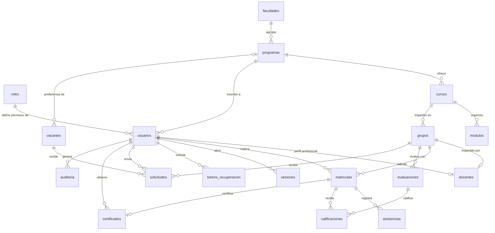
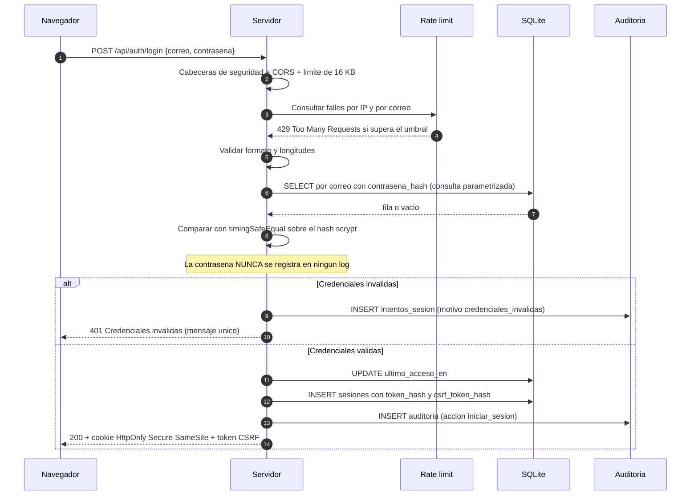

# Diccionario de datos - Sistema Educa

**Versión del esquema:** 1.0.0
**Motor:** SQLite 3.35 o superior (módulo nativo `node:sqlite` de Node.js 24)
**Script fuente:** [`esquema.sql`](esquema.sql)
**Alcance:** reto académico "Misión Git - Proyecto Web Educa"

> Base de datos **simulada** con fines academicos. No contiene datos reales de
> personas ni de instituciones: las personas, los cursos y las vacantes son
> ficticios.

---

## Como leer este documento

Cada tabla del esquema tiene una sección propia. Dentro de ella:

- Un parrafo con el **propósito** de la tabla y quien la consume.
- Una tabla de **campos** con las columnas: `Campo`, `Tipo`, `Clave`, `Nulo`,
  `Predet.` y `Descripcion`.
- La lista de **índices** que afectan a la tabla.
- La lista de **restricciones** (`CHECK` y `UNIQUE`) que el motor aplica.

En la columna `Clave`:

| Valor | Significado |
| --- | --- |
| `PK` | Clave primaria de la tabla. |
| `FK` | Clave foranea. Se indica la tabla y columna referenciada. |
| `PK, FK` | Ambas a la vez (tablas de uniun con clave primaria compartida). |
| `-` | Columna simple. |

Las polticas de borrado en cascada se anotan junto a la referencia: `CASCADE` borra
en cascada, `SET NULL` deja la referencia nula, `RESTRICT` impide el borrado mientras
existan filas dependientes.

## Convenciones

| Convencion | Regla |
| --- | --- |
| Nombres de tabla y campo | `snake_case`, en español y en singular. |
| Palabras reservadas SQL | En MAYUSCULAS. |
| Claves primarias | `INTEGER PRIMARY KEY AUTOINCREMENT`. No se usa `SERIAL`. |
| Dominios cerrados | `CHECK (columna IN (...))`. No se usa `ENUM`, porque SQLite no lo soporta. |
| Booleanos | `INTEGER` con `CHECK (col IN (0, 1))`. `0` es falso, `1` es verdadero. |
| Fechas | `TEXT` en ISO-8601 `AAAA-MM-DD` (sin hora). |
| Fechas-hora | `TEXT` en ISO-8601 UTC `AAAA-MM-DD HH:MM:SS`. El `CHECK` las compara lexicograficamente, por lo que el formato debe ser identico en todas. |
| Importes | `REAL`, sin simbolo de moneda ni separador de miles. |
| Texto multilinea | `TEXT`. En SQLite `TEXT` no tiene limite de longitud util. |
| Bajas | Lógica mediante el campo `estado`. El borrado fisico solo existe donde la FK usa `ON DELETE CASCADE`. |
| Marcas de tiempo | `creado_en`, `actualizado_en`. `actualizado_en` lo mantiene el trigger `trg_usuarios_actualizado_en` en `usuarios`. |

---

## Resumen de entidades

| Tabla | Tipo | propósito | Campos |
| --- | --- | --- | ---: |
| `roles` | Seguridad | Catálogo de roles que determina los permisos (RBAC). | 5 |
| `facultades` | Organización | Unidad académica que agrupa programas. | 5 |
| `programas` | Académico | Programa de grado que otorga título y agrupa cursos. | 10 |
| `usuarios` | Seguridad | Registro único de personas: estudiantes, docentes y personal. | 15 |
| `tokens_recuperacion` | Seguridad | Tokens de un solo uso para recuperar contraseña o verificar correo. | 8 |
| `cursos` | Académico | Unidad pedagogica y comercial del catálogo público. | 19 |
| `modulos` | Académico | Unidades tematicas ordenadas del plan de estudios. | 7 |
| `docentes` | Comunidad | Perfil profesional 1:1 con un usuario. | 7 |
| `grupos` | Operación | Edicion concreta de un curso, con docente, cupo y horario. | 11 |
| `matriculas` | Operación | Inscripcion de un estudiante a un grupo. | 11 |
| `asistencias` | Operación | Registro de asistencia por fecha de cada matrícula. | 8 |
| `evaluaciones` | Operación | Pruebas de un grupo con su peso en la nota final. | 8 |
| `calificaciones` | Operación | Nota obtenida por un estudiante en una evaluacion. | 9 |
| `certificados` | Operación | Certificado de finalizacion con código de verificación público. | 12 |
| `vacantes` | Empleo | Oferta laboral publicada en la bolsa de trabajo. | 13 |
| `solicitudes` | Empleo | Postulación de un usuario a un grupo o a una vacante. | 11 |
| `sesiones` | Seguridad | Sesiones activas del backend, con token hasheado. | 11 |
| `intentos_sesion` | Seguridad | Bitácora de intentos de autenticación (throttling y deteccion de ataques). | 8 |
| `auditoria` | Seguridad | Trazabilidad de acciones relevantes sobre cualquier entidad. | 10 |

Las vistas `vista_catalogo_cursos` y `vista_certificados_publicos` no son tablas: se
documentan en la sección [Vistas](#vistas).

---

## relaciones principales

Lectura del diagrama: `roles`, `facultades` y `programas` son catalogos maestros.
`usuarios` cuelga de `roles`. El eje académico es `cursos -> grupos -> matriculas ->
calificaciones`. La seguridad se apoya en `sesiones`, `intentos_sesion` y `auditoria`,
que cuelgan de `usuarios`.

---

## 1. Identidad, roles y seguridad

### Tabla: `roles`

Catálogo de los roles de autorizacion del sistema. Es una tabla y no una constante en
el código para que el backend resuelva permisos sin necesidad de desplegar cambios.
La consume el módulo de autorizacion (`backend/src/autorizacion.js`).

| Campo | Tipo | Clave | Nulo | Predet. | Descripción |
| --- | --- | --- | --- | --- | --- |
| `id` | INTEGER | PK | NO | autoinc | Identificador del rol. |
| `nombre` | TEXT | - | NO | - | Nombre tecnico del rol (`administrador`, `docente`, `estudiante`, `soporte`). Único: impide roles duplicados. |
| `descripcion` | TEXT | - | SI | - | Alcance funcional de los permisos del rol. |
| `activo` | INTEGER | - | NO | 1 | Marca de activacion lógica. `0` retira el rol del catálogo sin borrarlo. |
| `creado_en` | TEXT | - | NO | CURRENT_TIMESTAMP | Fecha-hora UTC de creación. |

**Índices**

- `UNIQUE (nombre)`, generado automáticamente por la restriccion.

**Restricciones**

- `nombre`: `CHECK (length(trim(nombre)) >= 3)`.
- `activo`: `CHECK (activo IN (0, 1))`.

---

### Tabla: `facultades`

Unidad académica de primer nivel que agrupa programas (por ejemplo, "Facultad de
Ingenieria y Sistemas"). Sirve para clasificar y reportar por unidad.

| Campo | Tipo | Clave | Nulo | Predet. | Descripción |
| --- | --- | --- | --- | --- | --- |
| `id` | INTEGER | PK | NO | autoinc | Identificador de la facultad. |
| `nombre` | TEXT | - | NO | - | Nombre completo de la facultad. Único. |
| `sigla` | TEXT | - | NO | - | Abreviatura de 2 a 10 caracteres usada en certificados y reportes (por ejemplo `FIS`). Única. |
| `descripcion` | TEXT | - | SI | - | Texto descriptivo de la unidad. |
| `creado_en` | TEXT | - | NO | CURRENT_TIMESTAMP | Fecha-hora UTC de creación. |

**Índices**

- `UNIQUE (nombre)` y `UNIQUE (sigla)`, automáticos.

**Restricciones**

- `nombre`: `CHECK (length(trim(nombre)) >= 3)`.
- `sigla`: `CHECK (length(sigla) BETWEEN 2 AND 10)`.

---

### Tabla: `programas`

Programa académico de grado que otorga un título. Un programa agrupa varios `cursos`;
un curso puede no pertenecer a ningun programa (formación continua), por eso su FK
hacia programas es nullable.

| Campo | Tipo | Clave | Nulo | Predet. | Descripción |
| --- | --- | --- | --- | --- | --- |
| `id` | INTEGER | PK | NO | autoinc | Identificador del programa. |
| `facultad_id` | INTEGER | FK -> `facultades.id` | NO | - | Facultad responsable. `ON DELETE RESTRICT`: no se elimina una facultad con programas asociados. |
| `nombre` | TEXT | - | NO | - | Nombre del programa (por ejemplo "Ingenieria en Software"). |
| `codigo` | TEXT | - | NO | - | Código académico corto (por ejemplo `IS-ING`). Único. |
| `titulo_grado` | TEXT | - | NO | - | Título que se otorga al graduado. Dominio: `Tecnologo`, `Ingeniero`, `Licenciado`, `Especialista`, `Maestro`, `Diplomado`. |
| `duracion_semestres` | INTEGER | - | SI | - | Duración de la carrera. `NULL` si no aplica. Regla: entre 1 y 12. |
| `descripcion` | TEXT | - | SI | - | Presentacion académica del programa. |
| `estado` | TEXT | - | NO | activo | Dominio: `activo`, `inactivo`, `suspendido`. |
| `creado_en` | TEXT | - | NO | CURRENT_TIMESTAMP | Fecha-hora UTC de creación. |
| `actualizado_en` | TEXT | - | NO | CURRENT_TIMESTAMP | Fecha-hora UTC de la ultima modificacion. |

**Índices**

- `ix_programas_facultad (facultad_id)`.
- `ix_programas_estado (estado)`.
- `ix_programas_nombre (nombre)`.
- `UNIQUE (codigo)`, automático.

**Restricciones**

- `titulo_grado`: `CHECK` de dominio cerrado con los 6 títulos indicados.
- `duracion_semestres`: `CHECK (duracion_semestres IS NULL OR duracion_semestres BETWEEN 1 AND 12)`.
- `estado`: `CHECK (estado IN ('activo', 'inactivo', 'suspendido'))`.

---

### Tabla: `usuarios`

Registro único de personas: estudiantes, docentes, administradores y soporte. Es la
tabla maestra de identidad y autenticación. El rol define los permisos y los perfiles
especializados (por ejemplo `docentes`) cuelgan de ella.

| Campo | Tipo | Clave | Nulo | Predet. | Descripción |
| --- | --- | --- | --- | --- | --- |
| `id` | INTEGER | PK | NO | autoinc | Identificador del usuario. |
| `correo` | TEXT | - | NO | - | Correo institucional y identificador de acceso. `COLLATE NOCASE`: el inicio de sesión y el `UNIQUE` no distinguen mayusculas de minusculas. Regla: debe contener una arroba en una posicion valida. |
| `contrasena_hash` | TEXT | - | NO | - | Hash de la contraseña con sal incluida. **SENSIBLE**: nunca se expone por la API ni se escribe en un log. |
| `rol_id` | INTEGER | FK -> `roles.id` | NO | - | Rol que determina los permisos. `ON DELETE RESTRICT`. |
| `nombre` | TEXT | - | NO | - | Nombre(s) de pila. Regla: al menos 2 caracteres utiles. |
| `apellidos` | TEXT | - | SI | - | Apellidos. `NULL` permitido para incentivas aun incompletas. |
| `documento_id` | TEXT | - | SI | - | Documento de identidad. Dato personal: se enmascara en la API (`***-45-67890`). Único. |
| `telefono` | TEXT | - | SI | - | Telefono de contacto. Dato personal. |
| `fecha_nacimiento` | TEXT | - | SI | - | Fecha de nacimiento ISO-8601. Dato personal. Regla: debe seguir el patron `AAAA-MM-DD`. |
| `programa_id` | INTEGER | FK -> `programas.id` | SI | - | Programa en el que esta inscrito el estudiante. `NULL` para personal. `ON DELETE SET NULL`. |
| `estado` | TEXT | - | NO | activo | Dominio: `activo`, `inactivo`, `bloqueado`, `pendiente`, `eliminado`. `eliminado` es la baja lógica: el historial académico se conserva y por eso las FKs académicas usan `RESTRICT`. |
| `acepta_terminos` | INTEGER | - | NO | 0 | `1` si la persona acepto los terminos y la política de privacidad. El registro exige `1`. |
| `ultimo_acceso_en` | TEXT | - | SI | - | Fecha-hora UTC del ultimo inicio de sesión exitoso. Se escribe al autenticar. |
| `creado_en` | TEXT | - | NO | CURRENT_TIMESTAMP | Fecha-hora UTC de alta. |
| `actualizado_en` | TEXT | - | NO | CURRENT_TIMESTAMP | Fecha-hora UTC de la ultima modificacion, mantenida por el trigger. |

**Índices**

- `ix_usuarios_rol (rol_id)`.
- `ix_usuarios_estado (estado)`.
- `ix_usuarios_programa (programa_id)`.
- `ix_usuarios_apellidos (apellidos)`.
- `ix_usuarios_creado_en (creado_en DESC)`.
- `UNIQUE (correo)` y `UNIQUE (documento_id)`, automáticos. `correo` es la busqueda
  crítica del inicio de sesión.

**Restricciones**

- `correo`: `CHECK (instr(correo, '@') > 1)`.
- `contrasena_hash`: `CHECK (length(contrasena_hash) >= 20)`.
- `nombre`: `CHECK (length(trim(nombre)) >= 2)`.
- `apellidos`: `CHECK (apellidos IS NULL OR length(trim(apellidos)) >= 2)`.
- `fecha_nacimiento`: `CHECK` de patron `AAAA-MM-DD` mediante `GLOB`.
- `acepta_terminos`: `CHECK (acepta_terminos IN (0, 1))`.

---

### Tabla: `tokens_recuperacion`

Tokens de un solo uso para recuperación de contraseña y verificación de correo. Se
persiste **únicamente el hash** del token.

| Campo | Tipo | Clave | Nulo | Predet. | Descripción |
| --- | --- | --- | --- | --- | --- |
| `id` | INTEGER | PK | NO | autoinc | Identificador del token emitido. |
| `usuario_id` | INTEGER | FK -> `usuarios.id` | NO | - | Titular del token. `ON DELETE CASCADE`. |
| `token_hash` | TEXT | - | NO | - | Hash SHA-256 en hexadecimal del token. **SENSIBLE**: el valor en claro solo viaja en el correo y existe únicamente en memoria. |
| `proposito` | TEXT | - | NO | recuperación | Dominio: `recuperacion`, `verificacion_correo`, `cambio_contrasena`. |
| `creado_en` | TEXT | - | NO | CURRENT_TIMESTAMP | Fecha-hora UTC de emision. |
| `expira_en` | TEXT | - | NO | - | Fecha-hora UTC de caducidad. El backend la fija a 15 minutos. |
| `usado_en` | TEXT | - | SI | - | Fecha-hora UTC del primer uso. `NULL` mientras el token sigue vigente. |
| `ip` | TEXT | - | SI | - | IP desde la que se emitio, para auditoria. |

**Índices**

- `ix_tokens_usuario (usuario_id, expira_en)`.
- `ix_tokens_expira (expira_en)`, usado por la limpieza periodica de tokens caducados.
- `UNIQUE (token_hash)`, automático.

**Restricciones**

- `token_hash`: `CHECK (length(token_hash) >= 32)`.
- `proposito`: `CHECK (proposito IN ('recuperacion', 'verificacion_correo', 'cambio_contrasena'))`.

---

## 2. Catálogo académico

### Tabla: `cursos`

Unidad pedagogica y comercial que se pública en el catálogo. El campo `slug` esta
alineado con `frontend/js/cursos.js` para que el backend resuelva
`detalle.html?curso=web` sin lógica adicional. La consultan el catálogo público y la
vista `vista_catalogo_cursos`.

| Campo | Tipo | Clave | Nulo | Predet. | Descripción |
| --- | --- | --- | --- | --- | --- |
| `id` | INTEGER | PK | NO | autoinc | Identificador del curso. |
| `programa_id` | INTEGER | FK -> `programas.id` | SI | - | Programa al que pertenece. `NULL` en cursos de formación continua. `ON DELETE SET NULL`: reorganizar la oferta no pierde el curso. |
| `nombre` | TEXT | - | NO | - | Nombre comercial del curso. |
| `slug` | TEXT | - | NO | - | Identificador de URL (`detalle.html?curso=<slug>`). Único y restringido a ASCII minusculas, guiones y digitos. |
| `codigo` | TEXT | - | NO | - | Código administrativo del curso (`EDU-WEB`). Único. |
| `descripcion` | TEXT | - | SI | - | Descripción larga del programa. |
| `creditos` | INTEGER | - | NO | 0 | Créditos academicos. Regla: mayor o igual a 0. |
| `precio` | REAL | - | NO | - | Valor de venta, sin simbolo de moneda. Regra: mayor o igual a 0. |
| `precio_antes` | REAL | - | SI | - | Precio de referencia tachado en el catálogo. `NULL` si no hay descuento. |
| `modalidad` | TEXT | - | NO | online | Dominio: `presencial`, `hibrida`, `online`, `online_en_vivo`. |
| `dificultad` | TEXT | - | NO | principiante | Nivel tecnico. Dominio: `principiante`, `intermedio`, `avanzado`. |
| `nivel_descripcion` | TEXT | - | SI | - | Etiqueta comercial de nivel tal como se pública (por ejemplo "Principiante a intermedio"). |
| `duracion_semanas` | INTEGER | - | SI | - | Duración en semanas. `NULL` si no aplica. Regla: mayor a 0. |
| `horas` | INTEGER | - | NO | 0 | Carga horaria semanal declarada en el catálogo. Regla: mayor o igual a 0. |
| `imagen_url` | TEXT | - | SI | - | Ruta o URL de la imagen de portada. |
| `destacado` | INTEGER | - | NO | 0 | `1` si el curso aparece en la sección destacada del inicio. |
| `estado` | TEXT | - | NO | borrador | Dominio: `borrador`, `publicado`, `archivado`. Solo `publicado` aparece en el catálogo. |
| `creado_en` | TEXT | - | NO | CURRENT_TIMESTAMP | Fecha-hora UTC de creación. |
| `actualizado_en` | TEXT | - | NO | CURRENT_TIMESTAMP | Fecha-hora UTC de la ultima modificacion. |

**Índices**

- `ix_cursos_programa (programa_id)`.
- `ix_cursos_estado (estado)`.
- `ix_cursos_dificultad (dificultad)`.
- `ix_cursos_estado_precio (estado, precio)`, índice compuesto del filtro basico del
  catálogo: estado publicado ordenado por precio.
- `UNIQUE (slug)` y `UNIQUE (codigo)`, automáticos.

**Restricciones**

- `nombre`: `CHECK (length(trim(nombre)) >= 3)`.
- `slug`: `CHECK` que rechaza cualquier caracter fuera de `[a-z0-9-]` y exige al menos 2 caracteres.
- `creditos`, `horas`: `CHECK (col >= 0)`.
- `precio`: `CHECK (precio >= 0)`. `precio_antes`: `CHECK (precio_antes IS NULL OR precio_antes >= 0)`.
- `modalidad`, `dificultad`, `estado`: dominios cerrados de 4, 3 y 3 valores respectivamente.
- `destacado`: `CHECK (destacado IN (0, 1))`.

---

### Tabla: `modulos`

Unidades tematicas ordenadas del plan de estudios de un curso.

| Campo | Tipo | Clave | Nulo | Predet. | Descripción |
| --- | --- | --- | --- | --- | --- |
| `id` | INTEGER | PK | NO | autoinc | Identificador del módulo. |
| `curso_id` | INTEGER | FK -> `cursos.id` | NO | - | Curso al que pertenece. `ON DELETE CASCADE`: al eliminar un curso se elimina su plan de estudios. |
| `nombre` | TEXT | - | NO | - | Nombre del módulo. Regla: al menos 3 caracteres utiles. |
| `descripcion` | TEXT | - | SI | - | Contenido y objetivos del módulo. |
| `orden` | INTEGER | - | NO | - | Posicion dentro del plan de estudios. Regla: mayor a 0. |
| `duracion_minutos` | INTEGER | - | SI | - | Duración estimada. `NULL` si no aplica. Regla: mayor a 0. |
| `creado_en` | TEXT | - | NO | CURRENT_TIMESTAMP | Fecha-hora UTC de creación. |

**Índices**

- `ix_modulos_curso (curso_id)`.
- `UNIQUE (curso_id, orden)` como `CONSTRAINT ux_modulos_curso_orden`: impide dos módulos
  en la misma posicion.

**Restricciones**

- `nombre`: `CHECK (length(trim(nombre)) >= 3)`.
- `orden`: `CHECK (orden > 0)`.

---

### Tabla: `docentes`

Perfil profesional en relación 1:1 con un usuario. Permite que una persona sea docente
sin duplicar identidad ni credenciales.

| Campo | Tipo | Clave | Nulo | Predet. | Descripción |
| --- | --- | --- | --- | --- | --- |
| `id` | INTEGER | PK | NO | autoinc | Identificador del perfil docente. |
| `usuario_id` | INTEGER | FK -> `usuarios.id` | NO | - | Usuario asociado. Único y `ON DELETE CASCADE`: al borrarse el usuario se borra el perfil; los grupos asignados bloquean el borrado por `RESTRICT`. |
| `especialidad` | TEXT | - | NO | - | Area de especialidad (por ejemplo "Seguridad de Aplicaciones"). |
| `titulo_academico` | TEXT | - | SI | - | Título o certificacion profesional (`CISSP`, `PhD en Inteligencia Artificial`). |
| `biografia` | TEXT | - | SI | - | Presentacion pública del docente. |
| `experiencia_anios` | INTEGER | - | SI | - | Anos de experiencia. `NULL` si no aplica. Regla: mayor o igual a 0. |
| `creado_en` | TEXT | - | NO | CURRENT_TIMESTAMP | Fecha-hora UTC de creación. |

**Índices**

- `ix_docentes_especialidad (especialidad)`.
- `UNIQUE (usuario_id)`, automático: garantiza la relación 1:1.

**Restricciones**

- `especialidad`: `CHECK (length(trim(especialidad)) >= 3)`.

---

## 3. Operación académica

### Tabla: `grupos`

Edicion o sección concreta de un curso, con docente, cupo y horario. Es la unidad real
de matrícula y permite ofrecer el mismo curso varias veces (turnos, modalidades o
docentes distintos).

**Nota de normalizacion:** no se almacena el número de inscritos. Se obtiene con
`COUNT(*)` sobre `matriculas`, para no duplicar estado derivado ni desincronizar el
conteo con el cupo.

| Campo | Tipo | Clave | Nulo | Predet. | Descripción |
| --- | --- | --- | --- | --- | --- |
| `id` | INTEGER | PK | NO | autoinc | Identificador del grupo. |
| `curso_id` | INTEGER | FK -> `cursos.id` | NO | - | Curso que se imparte. `ON DELETE RESTRICT`. |
| `docente_id` | INTEGER | FK -> `docentes.id` | SI | - | Docente asignado. `NULL` mientras el grupo no tenga docente. `ON DELETE RESTRICT`. |
| `codigo` | TEXT | - | NO | - | Código del grupo (`WEB-01-A`). Único. |
| `cupo` | INTEGER | - | NO | - | Número máximo de matriculados. Regla: mayor a 0. |
| `aula` | TEXT | - | SI | - | Salon o aula asignada. |
| `horario` | TEXT | - | SI | - | Descripción del horario (por ejemplo "Mar/Jue 18:00-20:00, salon 3"). |
| `fecha_inicio` | TEXT | - | SI | - | Fecha ISO-8601 de inicio del grupo. |
| `fecha_fin` | TEXT | - | SI | - | Fecha ISO-8601 de cierre del grupo. |
| `estado` | TEXT | - | NO | programado | Dominio: `programado`, `en_curso`, `finalizado`, `cancelado`. |
| `creado_en` | TEXT | - | NO | CURRENT_TIMESTAMP | Fecha-hora UTC de creación. |

**Índices**

- `ix_grupos_curso (curso_id)`.
- `ix_grupos_docente (docente_id)`.
- `ix_grupos_estado (estado)`.
- `UNIQUE (codigo)`, automático.

**Restricciones**

- `codigo`: `CHECK (length(trim(codigo)) >= 2)`.
- `cupo`: `CHECK (cupo > 0)`.
- `fecha_inicio` y `fecha_fin`: patron `AAAA-MM-DD` mediante `GLOB`.

---

### Tabla: `matriculas`

Inscripcion de un estudiante a un grupo. Es la tabla que une el historial académico de
una persona con la oferta de un curso.

| Campo | Tipo | Clave | Nulo | Predet. | Descripción |
| --- | --- | --- | --- | --- | --- |
| `id` | INTEGER | PK | NO | autoinc | Identificador de la matrícula. |
| `estudiante_id` | INTEGER | FK -> `usuarios.id` | NO | - | Usuario con rol estudiante. `ON DELETE RESTRICT`: el historial no se borra en cascada, la baja es lógica (`estado` en `usuarios`). |
| `grupo_id` | INTEGER | FK -> `grupos.id` | NO | - | Grupo en el que se inscribe. `ON DELETE RESTRICT`. |
| `estado` | TEXT | - | NO | pendiente | Dominio: `pendiente`, `activa`, `finalizada`, `cancelada`. Solo `activa` cuenta para el control de cupo. |
| `fecha_matricula` | TEXT | - | NO | CURRENT_DATE | Fecha ISO-8601 de la inscripcion. |
| `progreso` | REAL | - | NO | 0 | Avance del curso en porcentaje. Regla: entre 0 y 100. |
| `nota_final` | REAL | - | SI | - | Calificacion final. `NULL` mientras el curso no termina. Regla: entre 0 y 100. |
| `calificacion` | TEXT | - | SI | - | Escala letter: `A` (>= 90), `B` (>= 80), `C` (>= 70), `D` (>= 60), `F` (< 60). La calcula el backend a partir de `nota_final`. |
| `fecha_finalizacion` | TEXT | - | SI | - | Fecha ISO-8601 de cierre de la matrícula. |
| `creado_en` | TEXT | - | NO | CURRENT_TIMESTAMP | Fecha-hora UTC de creación. |
| `actualizado_en` | TEXT | - | NO | CURRENT_TIMESTAMP | Fecha-hora UTC de la ultima modificacion. |

**Índices**

- `ix_matriculas_estudiante (estudiante_id)`.
- `ix_matriculas_grupo (grupo_id)`.
- `ix_matriculas_estado (estado)`.
- `ix_matriculas_grupo_estado (grupo_id, estado)`, índice compuesto del control de cupo:
  cuenta solo las activas.
- `UNIQUE (grupo_id, estudiante_id)` como `CONSTRAINT ux_matriculas_grupo_estudiante`:
  impide la doble matrícula en el mismo grupo.

**Restricciones**

- `progreso`: `CHECK (progreso BETWEEN 0 AND 100)`.
- `nota_final`: `CHECK (nota_final IS NULL OR (nota_final >= 0 AND nota_final <= 100))`.
- `calificacion`: dominio cerrado `A`, `B`, `C`, `D`, `F`.

**Nota de integridad:** al validar el cupo, el backend debe contar las filas con
estado `activa` dentro de una transacción, para no sobrepasar `grupos.cupo` bajo
concurrencia.

---

### Tabla: `asistencias`

Registro de asistencia por fecha de cada matrícula.

| Campo | Tipo | Clave | Nulo | Predet. | Descripción |
| --- | --- | --- | --- | --- | --- |
| `id` | INTEGER | PK | NO | autoinc | Identificador del registro de asistencia. |
| `matricula_id` | INTEGER | FK -> `matriculas.id` | NO | - | Matrícula a la que corresponde. `ON DELETE CASCADE`: las asistencias de una matrícula eliminada no tienen sentido. |
| `fecha` | TEXT | - | NO | - | Fecha ISO-8601 de la sesión. |
| `estado` | TEXT | - | NO | - | Dominio: `presente`, `ausente`, `tardanza`, `justificada`, `permiso`. |
| `justificacion` | TEXT | - | SI | - | Motivo, cuando la ausencia esta justificada. |
| `minutos_tarde` | INTEGER | - | SI | - | Minutos de retraso en el estado `tardanza`. Regla: mayor o igual a 0. |
| `registrado_por` | INTEGER | FK -> `usuarios.id` | SI | - | Docente o soporte que registro la asistencia. `ON DELETE SET NULL`: si la persona se da de baja, el registro historico permanece. |
| `creado_en` | TEXT | - | NO | CURRENT_TIMESTAMP | Fecha-hora UTC de creación. |

**Índices**

- `ix_asistencias_matricula (matricula_id)`.
- `ix_asistencias_fecha (fecha)`.
- `ix_asistencias_estado (estado)`.
- `ix_asistencias_registrador (registrado_por)`.
- `UNIQUE (matricula_id, fecha)` como `CONSTRAINT ux_asistencias_matricula_fecha`:
  impide cargar dos veces la misma sesión del mismo estudiante.

**Restricciones**

- `fecha`: patron `AAAA-MM-DD` mediante `GLOB`.
- `estado`: `CHECK` de dominio cerrado con los 5 valores indicados.

---

### Tabla: `evaluaciones`

Pruebas de un grupo con su peso en la nota final.

| Campo | Tipo | Clave | Nulo | Predet. | Descripción |
| --- | --- | --- | --- | --- | --- |
| `id` | INTEGER | PK | NO | autoinc | Identificador de la evaluacion. |
| `grupo_id` | INTEGER | FK -> `grupos.id` | NO | - | Grupo al que pertenece la prueba. `ON DELETE CASCADE`. |
| `titulo` | TEXT | - | NO | - | Título de la evaluacion. Regla: al menos 3 caracteres utiles. |
| `tipo` | TEXT | - | NO | parcial | Dominio: `parcial`, `examen`, `tarea`, `proyecto`, `quiz`, `presentacion`. |
| `fecha` | TEXT | - | NO | - | Fecha ISO-8601 de aplicacion. |
| `ponderacion` | REAL | - | NO | - | Peso porcentual dentro de la nota final del grupo. Regla: mayor a 0 y menor o igual a 100. |
| `descripcion` | TEXT | - | SI | - | Contenido e instrucciones de la prueba. |
| `creado_en` | TEXT | - | NO | CURRENT_TIMESTAMP | Fecha-hora UTC de creación. |

**Índices**

- `ix_evaluaciones_grupo (grupo_id)`.
- `ix_evaluaciones_fecha (fecha)`.
- `UNIQUE (grupo_id, titulo)` como `CONSTRAINT ux_evaluaciones_grupo_titulo`.

**Restricciones**

- `titulo`: `CHECK (length(trim(titulo)) >= 3)`.
- `tipo`: dominio cerrado de 6 valores.
- `ponderacion`: `CHECK (ponderacion > 0 AND ponderacion <= 100)`.

**Regla de negocio:** la suma de `ponderacion` de un grupo debe ser 100. El backend
debe validarlo antes de cerrar el grupo.

---

### Tabla: `calificaciones`

Nota obtenida por un estudiante en una evaluacion.

| Campo | Tipo | Clave | Nulo | Predet. | Descripción |
| --- | --- | --- | --- | --- | --- |
| `id` | INTEGER | PK | NO | autoinc | Identificador de la calificacion. |
| `evaluacion_id` | INTEGER | FK -> `evaluaciones.id` | NO | - | Evaluacion calificada. `ON DELETE CASCADE`. |
| `matricula_id` | INTEGER | FK -> `matriculas.id` | NO | - | Matrícula del estudiante. `ON DELETE CASCADE`. |
| `nota` | REAL | - | NO | - | Nota en escala de 0 a 100. Regla: entre 0 y 100. |
| `observaciones` | TEXT | - | SI | - | Comentario del docente para el estudiante. |
| `publicado` | INTEGER | - | NO | 0 | `0` = nota privada; `1` = nota visible para el estudiante. |
| `docente_id` | INTEGER | FK -> `docentes.id` | SI | - | Docente que registro la nota, para autoria y auditoria. `ON DELETE SET NULL`. |
| `creado_en` | TEXT | - | NO | CURRENT_TIMESTAMP | Fecha-hora UTC de creación. |
| `actualizado_en` | TEXT | - | NO | CURRENT_TIMESTAMP | Fecha-hora UTC de la ultima modificacion. |

**Índices**

- `ix_calificaciones_matricula (matricula_id)`.
- `ix_calificaciones_evaluacion (evaluacion_id)`.
- `ix_calificaciones_docente (docente_id)`.
- `UNIQUE (evaluacion_id, matricula_id)` como `CONSTRAINT ux_calificaciones_evaluacion_matricula`:
  impide duplicar la calificacion.

**Restricciones**

- `nota`: `CHECK (nota >= 0 AND nota <= 100)`.
- `publicado`: `CHECK (publicado IN (0, 1))`.

---

### Tabla: `certificados`

Certificado de finalizacion con código de verificación público.

| Campo | Tipo | Clave | Nulo | Predet. | Descripción |
| --- | --- | --- | --- | --- | --- |
| `id` | INTEGER | PK | NO | autoinc | Identificador del certificado. |
| `usuario_id` | INTEGER | FK -> `usuarios.id` | NO | - | Titular del certificado. `ON DELETE RESTRICT`: un certificado es evidencia académica y no se borra. |
| `matricula_id` | INTEGER | FK -> `matriculas.id` | NO | - | Matrícula que lo origina. Único: una matrícula genera un único certificado. `ON DELETE RESTRICT`. |
| `codigo_verificacion` | TEXT | - | NO | - | Código público de verificación (`EDU-2026-4F2A9C`). No es secreto. Único. |
| `horas_acreditadas` | REAL | - | SI | - | Horas acreditadas por el certificado. `NULL` si no aplica. |
| `nota_final` | REAL | - | SI | - | Nota final reflejada en el certificado. `NULL` si no aplica. Regla: entre 0 y 100. |
| `url_publico` | TEXT | - | SI | - | Dirección pública de verificación del certificado. |
| `emitido_en` | TEXT | - | NO | CURRENT_TIMESTAMP | Fecha-hora UTC de emision. |
| `revocable` | INTEGER | - | NO | 1 | `0` = certificado inrevocable según la política de la institución. |
| `revocado_en` | TEXT | - | SI | - | Fecha-hora UTC de la revocación. |
| `motivo_revocacion` | TEXT | - | SI | - | Motivo de la revocación. |
| `estado` | TEXT | - | NO | emitido | Dominio: `emitido`, `revocado`, `anulado`. |

**Índices**

- `ix_certificados_usuario (usuario_id)`.
- `ix_certificados_emitido (emitido_en DESC)`.
- `ix_certificados_estado (estado)`.
- `UNIQUE (matricula_id)` y `UNIQUE (codigo_verificacion)`, automáticos.

**Restricciones**

- `codigo_verificacion`: `CHECK (length(trim(codigo_verificacion)) >= 8)`.
- `revocable`: `CHECK (revocable IN (0, 1))`.
- `nota_final`: entre 0 y 100.
- `CONSTRAINT ck_certificados_revocacion`: coherencia entre `estado` y `revocado_en`;
  solo un certificado `revocado` tiene fecha de revocación.

---

## 4. Empleo y postulaciones

### Tabla: `vacantes`

Oferta laboral de la bolsa de trabajo publicada en el inicio del portal. No contiene
datos de personas, solo de la empresa y del puesto.

| Campo | Tipo | Clave | Nulo | Predet. | Descripción |
| --- | --- | --- | --- | --- | --- |
| `id` | INTEGER | PK | NO | autoinc | Identificador de la vacante. |
| `titulo` | TEXT | - | NO | - | Puesto ofertado. Regla: al menos 3 caracteres utiles. |
| `empresa` | TEXT | - | NO | - | Empresa que contrata. Regla: al menos 2 caracteres utiles. |
| `ubicacion` | TEXT | - | SI | - | Ciudad o pais. |
| `modalidad` | TEXT | - | NO | remoto | Dominio: `presencial`, `hibrida`, `remoto`. |
| `descripcion` | TEXT | - | SI | - | Detalle del puesto y requisitos. |
| `salario_min` | REAL | - | SI | - | Extremo inferior del rango salarial. `NULL` si no se pública. |
| `salario_max` | REAL | - | SI | - | Extremo superior del rango salarial. Nunca menor que `salario_min`. |
| `programa_id` | INTEGER | FK -> `programas.id` | SI | - | Programa preferente; sirve para validar la pertinencia de la postulación. `ON DELETE SET NULL`. |
| `estado` | TEXT | - | NO | borrador | Dominio: `borrador`, `publicada`, `pausada`, `cerrada`. |
| `publicada_en` | TEXT | - | SI | - | Fecha-hora UTC de publicación. |
| `cierra_en` | TEXT | - | SI | - | Fecha-hora UTC de cierre de la postulación. |
| `creado_en` | TEXT | - | NO | CURRENT_TIMESTAMP | Fecha-hora UTC de creación. |

**Índices**

- `ix_vacantes_estado (estado)`.
- `ix_vacantes_programa (programa_id)`.
- `ix_vacantes_empresa (empresa)`.

**Restricciones**

- `modalidad`: dominio cerrado de 3 valores.
- `estado`: dominio cerrado de 4 valores.
- `salario_min` y `salario_max`: `CHECK (col IS NULL OR col >= 0)`.
- `CONSTRAINT ck_vacantes_rango`: `salario_max >= salario_min` cuando ambos existen.

---

### Tabla: `solicitudes`

Postulación de un usuario, con dos destinos posibles:

- `grupo_id`: postulación a un grupo del catálogo (boton "Postular ahora" de `frontend/js/cursos.js`).
- `vacante_id`: postulación a una vacante de la bolsa de trabajo.

El `CHECK` exige **exactamente** un destino, lo que garantiza la integridad del modelo
sin duplicar tablas ni permitir postulaciones huerfanas.

| Campo | Tipo | Clave | Nulo | Predet. | Descripción |
| --- | --- | --- | --- | --- | --- |
| `id` | INTEGER | PK | NO | autoinc | Identificador de la postulación. |
| `usuario_id` | INTEGER | FK -> `usuarios.id` | NO | - | Persona que postula. `ON DELETE CASCADE`. |
| `grupo_id` | INTEGER | FK -> `grupos.id` | SI | - | Destino tipo curso. `ON DELETE CASCADE`. |
| `vacante_id` | INTEGER | FK -> `vacantes.id` | SI | - | Destino tipo vacante. `ON DELETE CASCADE`. |
| `estado` | TEXT | - | NO | pendiente | Dominio: `pendiente`, `en_revision`, `aceptada`, `rechazada`, `cancelada`. |
| `motivo` | TEXT | - | SI | - | Carta de presentacion o motivo de la postulación. |
| `cv_url` | TEXT | - | SI | - | Enlace al currículum. Validar que apunte a un dominio permitido antes de renderizarlo. |
| `enviada_en` | TEXT | - | NO | CURRENT_TIMESTAMP | Fecha-hora UTC de envio. |
| `revisada_en` | TEXT | - | SI | - | Fecha-hora UTC de la revision. |
| `revisada_por` | INTEGER | FK -> `usuarios.id` | SI | - | Soporte o administrador que realizo la revision. `ON DELETE SET NULL`. |
| `respuesta` | TEXT | - | SI | - | Respuesta oficial enviada a la persona. |

**Índices**

- `ix_solicitudes_usuario (usuario_id, estado)`.
- `ix_solicitudes_grupo (grupo_id, estado)`.
- `ix_solicitudes_vacante (vacante_id, estado)`.
- `ix_solicitudes_revisor (revisada_por)`.
- `ux_solicitudes_usuario_grupo (usuario_id, grupo_id) WHERE grupo_id IS NOT NULL`: índice
  único parcial, una postulación por curso.
- `ux_solicitudes_usuario_vacante (usuario_id, vacante_id) WHERE vacante_id IS NOT NULL`:
  índice único parcial, una postulación por vacante.

**Restricciones**

- `CONSTRAINT ck_solicitudes_destino`: `(grupo_id IS NULL) <> (vacante_id IS NULL)`, es
  decir, exactamente uno de los dos destinos.
- `estado`: dominio cerrado de 5 valores.

---

## 5. Sesiones, trazas y auditoria

### Tabla: `sesiones`

Sesiones activas del backend, usadas por la autenticación con cookie. **Lectura
obligatoria del backend:**

- Se genera un token opaco aleatorio de 32 bytes o más para el navegador y se persiste
  **únicamente** `token_hash` = SHA-256 del token. Si alguien lee la base de datos, no
  puede suplantar a ninguna persona.
- `csrf_token_hash` guarda el hash del token anti-CSRF por la misma razon: nunca se
  almacena el valor en claro.
- La cookie debe enviarse con `HttpOnly`, `Secure` y `SameSite=Lax` o `Strict`.
- La revocación es lógica: se fija `revocada_en`. Invalidar todas las sesiones de un
  usuario es un único `UPDATE` sobre esta tabla.
- `expira_en` y `creada_en` deben usar siempre el mismo formato ISO-8601 UTC, porque el
  `CHECK` las compara lexicograficamente.

| Campo | Tipo | Clave | Nulo | Predet. | Descripción |
| --- | --- | --- | --- | --- | --- |
| `id` | INTEGER | PK | NO | autoinc | Identificador de la sesión. |
| `usuario_id` | INTEGER | FK -> `usuarios.id` | NO | - | Titular de la sesión. `ON DELETE CASCADE`. |
| `token_hash` | TEXT | - | NO | - | SHA-256 en hexadecimal (64 caracteres) del token de sesión. **SENSIBLE**: no se expone nunca. |
| `csrf_token_hash` | TEXT | - | NO | - | SHA-256 del token anti-CSRF entregado en la respuesta de inicio de sesión. **SENSIBLE**. |
| `agente_usuario` | TEXT | - | SI | - | Cabecera `User-Agent`, para auditoria y deteccion de anomalias. |
| `ip` | TEXT | - | SI | - | IP de origen de la sesión. |
| `creada_en` | TEXT | - | NO | CURRENT_TIMESTAMP | Fecha-hora UTC de emision de la sesión. |
| `expira_en` | TEXT | - | NO | - | Fecha-hora UTC de caducidad. El backend la fija a 8 horas, o 30 dias si la persona eligio "recordarme". |
| `ultimo_uso_en` | TEXT | - | SI | - | Fecha-hora UTC de la ultima peticion autenticada con esta sesión. |
| `revocada_en` | TEXT | - | SI | - | Fecha-hora UTC de revocación. `NULL` mientras la sesión esta viva. |
| `motivo_revocacion` | TEXT | - | SI | - | Motivo: `cierre_sesion`, `cambio_contrasena`, `expiro`, `administrador`. |

**Índices**

- `ix_sesiones_usuario (usuario_id)`.
- `ix_sesiones_expira (expira_en)`, para la limpieza periodica.
- `ix_sesiones_usuario_viva (usuario_id, revocada_en, expira_en)`: consulta crítica de
  seguridad, lista las sesiones vivas de una persona.
- `UNIQUE (token_hash)`, automático.

**Restricciones**

- `token_hash` y `csrf_token_hash`: `CHECK (length(col) >= 32)`.
- `CONSTRAINT ck_sesiones_ventana`: `CHECK (expira_en > creada_en)`.

---

### Tabla: `intentos_sesion`

Bitácora de intentos de autenticación. Es la base para el *throttling* (bloqueo temporal
por IP o por correo) y para detectar ataques de fuerza bruta.

**Retención mínima recomendada:** 90 dias, y anonimizar después (ver
[Reglas de seguridad](#reglas-de-seguridad-de-los-datos)).

| Campo | Tipo | Clave | Nulo | Predet. | Descripción |
| --- | --- | --- | --- | --- | --- |
| `id` | INTEGER | PK | NO | autoinc | Identificador del intento. |
| `correo` | TEXT | - | NO | - | Correo intentado; puede no existir en `usuarios`. `COLLATE NOCASE`. |
| `usuario_id` | INTEGER | FK -> `usuarios.id` | SI | - | Usuario resuelto cuando el correo si existe. `NULL` si no existe. `ON DELETE SET NULL`. |
| `ip` | TEXT | - | SI | - | IP de origen. Clave del throttling. |
| `agente_usuario` | TEXT | - | SI | - | `User-Agent` del cliente. |
| `exitoso` | INTEGER | - | NO | 0 | `1` = autenticación exitosa; `0` = fallo. |
| `motivo` | TEXT | - | NO | - | Dominio: `exitoso`, `credenciales_invalidas`, `correo_inexistente`, `cuenta_bloqueada`, `cuenta_inactiva`, `throttling`, `token_invalido`, `csrf_invalido`. |
| `creado_en` | TEXT | - | NO | CURRENT_TIMESTAMP | Fecha-hora UTC del intento. |

**Índices**

- `ix_intentos_correo (correo, creado_en DESC)`: cuenta fallos por correo en la ventana.
- `ix_intentos_ip (ip, creado_en DESC)`: cuenta fallos por IP en la ventana.
- `ix_intentos_usuario (usuario_id)`.
- `ix_intentos_creado_en (creado_en DESC)`: soporta la purga por antiguedad.

**Restricciones**

- `exitoso`: `CHECK (exitoso IN (0, 1))`.
- `motivo`: dominio cerrado de 8 valores.

**Regla de seguridad:** con los motivos `credenciales_invalidas` y `correo_inexistente`
la API debe responder **siempre el mismo mensaje**, para no revelar que correos estan
registrados.

---

### Tabla: `auditoria`

Trazabilidad de acciones relevantes (alta, actualización, borrado, autenticación,
exportacion). `datos_antes` y `datos_despues` guardan instantaneas JSON para reconstruir
el cambio.

| Campo | Tipo | Clave | Nulo | Predet. | Descripción |
| --- | --- | --- | --- | --- | --- |
| `id` | INTEGER | PK | NO | autoinc | Identificador del evento. |
| `usuario_id` | INTEGER | FK -> `usuarios.id` | SI | - | Actor de la accion. `NULL` cuando la accion no tiene actor (por ejemplo, un intento fallido). `ON DELETE SET NULL`. |
| `accion` | TEXT | - | NO | - | Dominio: `crear`, `leer`, `actualizar`, `eliminar`, `iniciar_sesion`, `cerrar_sesion`, `cambiar_contrasena`, `exportar`, `restaurar`, `acceder_denegado`. |
| `entidad` | TEXT | - | NO | - | Nombre de la tabla afectada. Regla: al menos 2 caracteres utiles. |
| `entidad_id` | INTEGER | - | SI | - | Clave primaria de la fila afectada. `NULL` si la accion no apunta a una fila. |
| `datos_antes` | TEXT | - | SI | - | Instantanea JSON previa al cambio. `CHECK` con `json_valid`. |
| `datos_despues` | TEXT | - | SI | - | Instantanea JSON posterior al cambio. `CHECK` con `json_valid`. |
| `ip` | TEXT | - | SI | - | IP de origen. |
| `agente_usuario` | TEXT | - | SI | - | `User-Agent` del cliente. |
| `creado_en` | TEXT | - | NO | CURRENT_TIMESTAMP | Fecha-hora UTC del evento. |

**Índices**

- `ix_auditoria_usuario (usuario_id, creado_en DESC)`.
- `ix_auditoria_entidad (entidad, entidad_id)`.
- `ix_auditoria_creado_en (creado_en DESC)`.

**Restricciones**

- `accion`: dominio cerrado de 10 valores.
- `entidad`: `CHECK (length(trim(entidad)) >= 2)`.
- `datos_antes` y `datos_despues`: `CHECK (col IS NULL OR json_valid(col))`.

**Reglas**

- Nunca se vuelca `contrasena_hash`, `token_hash` ni ningun dato sensible en estas
  columnas: el backend filtra la lista blanca de campos permitidos antes del `INSERT`.
- `auditoria` es de solo append. No se actualiza ni se borra (salvo por la política de
  retención).

---

## Vistas

Las vistas son el **único punto de acceso público** de datos del esquema. Por diseño no
incluyen ninguna columna de `usuarios`, de modo que no pueden filtrar datos personales.

### `vista_catalogo_cursos`

Alimenta el catálogo y las tarjetas destacadas del frontend. Solo devuelve cursos en
estado `publicado` y agrega dos conteos derivados que sustituyen los números quemados en
el HTML.

| Columna | Origen | Descripción |
| --- | --- | --- |
| `curso_id` | `cursos.id` | Identificador del curso. |
| `slug` | `cursos.slug` | Identificador de URL. |
| `nombre` | `cursos.nombre` | Nombre comercial. |
| `descripcion` | `cursos.descripcion` | Descripción larga. |
| `precio` | `cursos.precio` | Precio actual. |
| `precio_antes` | `cursos.precio_antes` | Precio tachado. |
| `modalidad` | `cursos.modalidad` | Modalidad. |
| `dificultad` | `cursos.dificultad` | Nivel tecnico. |
| `nivel_descripcion` | `cursos.nivel_descripcion` | Etiqueta de nivel. |
| `duracion_semanas` | `cursos.duracion_semanas` | Duración del curso. |
| `horas` | `cursos.horas` | Carga horaria semanal. |
| `imagen_url` | `cursos.imagen_url` | Imagen de portada. |
| `destacado` | `cursos.destacado` | Marca de destacado. |
| `programa_codigo`, `programa_nombre`, `titulo_grado` | `programas` | Datos del programa. |
| `facultad_sigla`, `facultad_nombre` | `facultades` | Datos de la facultad. |
| `postulaciones` | Subconsulta sobre `solicitudes` + `grupos` | Número de postulaciones al curso. |
| `matriculados` | Subconsulta sobre `matriculas` + `grupos` | Número de matrículas **activas** del curso. |

### `vista_certificados_publicos`

Responde a la verificación de un certificado a partir de su código.

| Columna | Origen | Descripción |
| --- | --- | --- |
| `codigo_verificacion` | `certificados.codigo_verificacion` | Código público buscado. |
| `estado_certificado` | `certificados.estado` | `emitido`, `revocado` o `anulado`. |
| `emitido_en`, `revocado_en` | `certificados` | Fechas de emision y revocación. |
| `horas_acreditadas`, `nota_final` | `certificados` | Datos academicos minimos. |
| `calificacion` | `matriculas.calificacion` | Escala letter obtenida. |
| `curso`, `curso_slug` | `cursos` | Curso certificado. |
| `grupo_codigo` | `grupos.codigo` | Edicion concreta. |

No expone nombre, correo, documento ni fecha de nacimiento del titular: solo el código
y los datos academicos minimos.

### Trigger `trg_usuarios_actualizado_en`

SQLite no admite la columna `ON UPDATE CURRENT_TIMESTAMP`, por lo que
`usuarios.actualizado_en` se mantiene con este trigger `AFTER UPDATE`. La clausula
`WHEN NEW.actualizado_en = OLD.actualizado_en` evita la reentrada: solo se actualiza la
marca de tiempo cuando el backend no fijo ya una nueva.

---

## Reglas de seguridad de los datos

Estas reglas son parte del modelo, no recomendaciones.

1. **Mínimo privilegio.** El usuario solo ve lo que le corresponde por rol y por
   relación. Un estudiante ve sus propias matrículas y sus propias calificaciones
   publicadas; un docente ve las de sus grupos; un administrador ve el conjunto. El
   endpoint valida la relación, no solo el rol.

2. **Nunca exponer material sensible.** `usuarios.contrasena_hash`,
   `sesiones.token_hash` y `sesiones.csrf_token_hash` jamás aparecen en una respuesta de
   la API ni en un log. El SELECT del backend usa una lista blanca de columnas; nunca
   `SELECT *` sobre `usuarios` para responder a un cliente.

3. **Enmascarar datos personales.** `documento_id`, `telefono` y `fecha_nacimiento`
   se enmascaran en respuestas públicas y en listados de personal (`***-45-67890`,
   `***-***-1234`). El documento completo solo se ve en la ficha del propio titular o
   de un administrador.

4. **Menor exposición del secreto.** El token de sesión viaja en una cookie `HttpOnly`
   (inaccesible a JavaScript), `Secure` y `SameSite`. **Nunca** se guarda en
   `localStorage`, porque cualquier script inyectado en la página lo podria leer. Por eso
   el frontend ya no usa `localStorage` para la sesión.

5. **No enumerar cuentas.** Ante un correo inexistente y ante una contraseña incorrecta
   la API responde exactamente lo mismo: `Credenciales invalidas`. La distincion se
   guarda solo en `intentos_sesion.motivo`, nunca en la respuesta.

6. **Registrar los accesos.** `intentos_sesion` alimenta el *throttling* (bloqueo
   temporal tras varios fallos desde la misma IP o el mismo correo) y `auditoria`
   registra toda accion administrativa. Sin estas tablas no hay forma de detectar un
   ataque de fuerza bruta ni de reconstruir un cambio.

7. **Retención y anonimizacion.** `intentos_sesion` se conserva 90 dias y después se
   anonimiza (`correo`, `ip` y `agente_usuario` a `NULL`, o el registro se elimina).
   `auditoria` tiene una retención más larga porque es evidencia. Los datos personales
   de personas dadas de baja se conservan solo mientras exista obligacion académica de
   preservar el historial.

8. **Siempre consultas parametrizadas.** Toda consulta se prepara con marcadores `?`
   (`db.prepare(sql).run(valor)`). **Nunca** se concatena la entrada del usuario dentro
   del texto SQL. Es la única defensa fiable contra la inyeccion SQL, y por eso el
   propio seed de este esquema usa marcadores en lugar de literales.

9. **Escapado en el frontend.** La base de datos no es el único punto de inyeccion: el
   frontend inserta datos en el DOM, asi que todo valor que llegue de la API se escapa
   (`textContent`, nunca `innerHTML` con datos).

---

## Diagrama de flujo de un inicio de sesión

